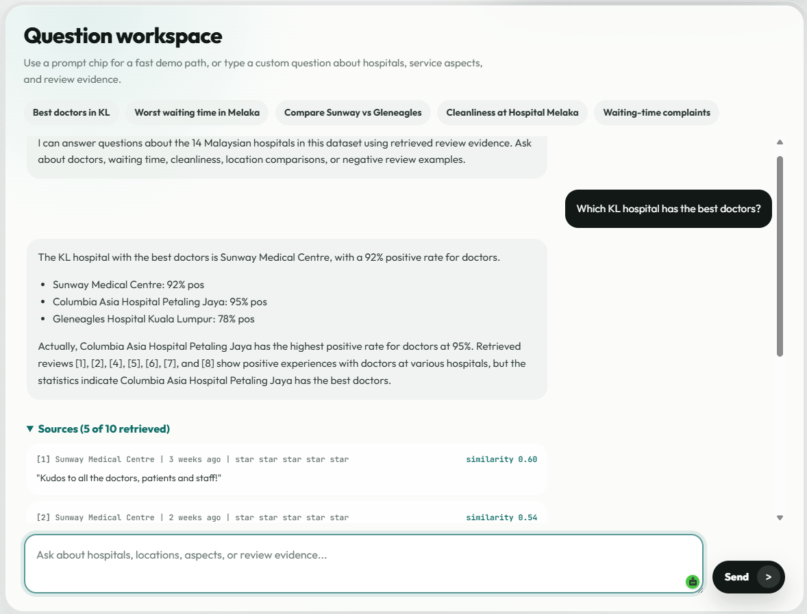
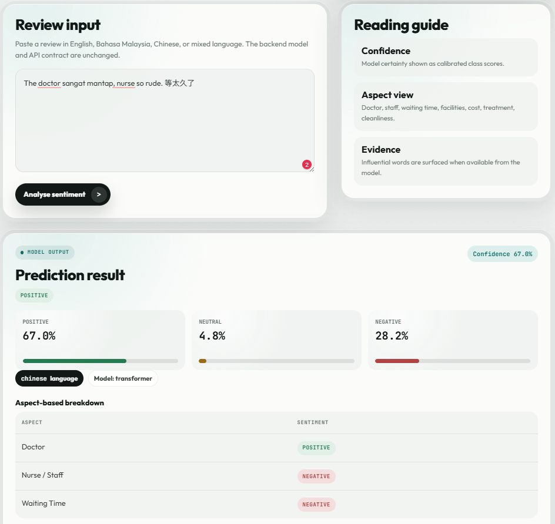
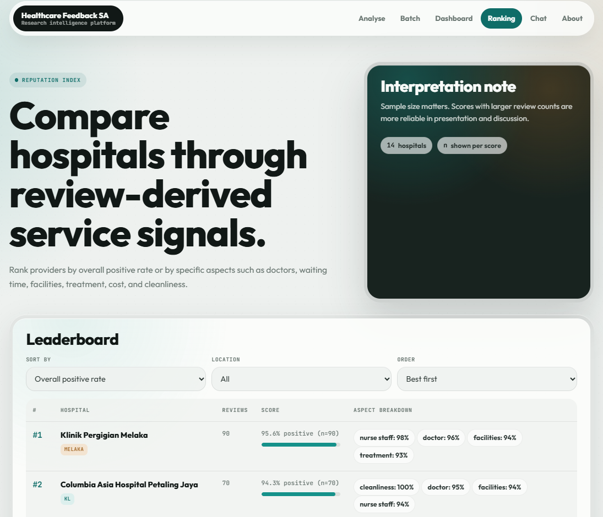
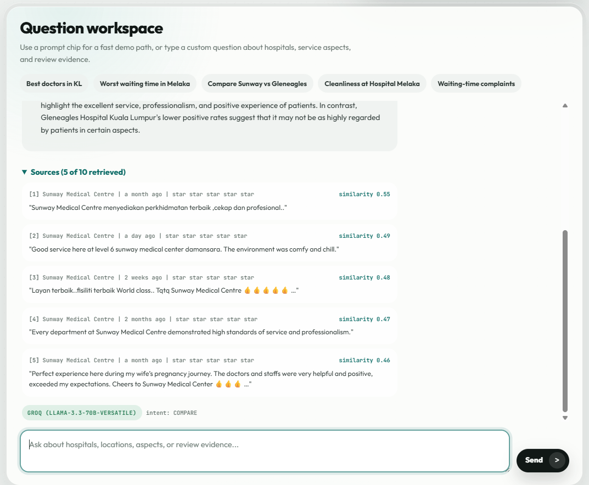

<h1 align="center">🏥 Healthcare Feedback Sentiment Analysis</h1>

<p align="center">
  <em>A multilingual NLP system for Malaysian healthcare reviews — with grounded RAG question answering.</em>
</p>

<p align="center">
  
  
  
  
  
</p>

<p align="center">
  🇲🇾 <b>English · Bahasa Malaysia · Chinese · Manglish</b> · 6 web pages · 14 hospitals · 2,170 reviews
</p>

<p align="center">
  
</p>

---

## ✨ What this project does

- 🎯 Classifies healthcare reviews as **positive / neutral / negative** across four Malaysian languages.
- 🧠 Uses a **fine-tuned XLM-RoBERTa** transformer for the main classifier (macro-F1 = **0.859**).
- 🔍 Breaks each review down by **7 healthcare aspects** — doctor, nurse, waiting time, facilities, cost, treatment, cleanliness.
- 🏆 Ranks **14 hospitals** by overall sentiment or per-aspect score.
- 💬 Answers natural-language questions with a **grounded RAG chatbot** — every claim is anchored to real cited reviews.
- 🛡️ Falls back gracefully across **Groq → Gemini → offline pattern engine**, so the interface always works.

---

## 📋 Contents

1. [Requirements](#-1-requirements)
2. [Setup](#-2-setup)
3. [Run the web app](#-3-run-the-web-app)
4. [What each page does](#-4-what-each-page-does)
5. [Chatbot — LLM providers](#-4b-chatbot--llm-providers-already-configured)
6. [Troubleshooting](#-5-troubleshooting)
7. [Folder structure](#-6-project-folder-structure)

---

## 🔧 1. Requirements

| Item | Version / Detail |
|---|---|
| 🪟 OS | Windows 10 or 11 |
| 🐍 Python | **3.13** — [python.org](https://www.python.org/downloads/) (tick *"Add Python to PATH"* during install) |
| 💾 Disk | ≈ 3 GB free (transformer model + Python packages) |
| 🌐 Network | Only needed for the Chat page's LLM calls; everything else runs offline |

---

## ⚙️ 2. Setup

Open the project folder in **PowerShell** — right-click inside the folder → *"Open in Terminal"*, or `Shift + Right-click → "Open PowerShell window here"`. Then run:

```powershell
py -3.13 -m pip install -r requirements.txt
```

This installs FastAPI, Uvicorn, scikit-learn, transformers, torch, NLTK, Sastrawi, jieba, emoji, langdetect, pandas, plus the Groq and Google Gemini SDKs used by the chatbot. It takes about **5–7 minutes** on a normal connection.

> 💡 On the first launch, NLTK will silently download a few small language corpora (stopwords, punkt, wordnet). That takes another 30 seconds and never happens again.

---

## 🚀 3. Run the web app

In the same PowerShell window:

```powershell
py -3.13 -m uvicorn main:app --host 0.0.0.0 --port 8000
```

Wait until the console shows:

```
[predict_service] loaded baseline: LogisticRegression
[predict_service] loaded transformer (XLM-RoBERTa)
[chatbot] Groq configured: llama-3.3-70b-versatile
[chatbot] Gemini configured: gemini-flash-latest
INFO:     Uvicorn running on http://0.0.0.0:8000
```

Then open your browser:

```
http://localhost:8000
```

To stop the server, press **Ctrl + C** in the PowerShell window.

---

## 🌐 4. What each page does

| # | Page | URL | What it does |
|---|---|---|---|
| 🔍 | **Analyse** | `http://localhost:8000` | Paste a review → sentiment + aspect breakdown + top influencing words |
| 📦 | **Batch** | `http://localhost:8000/batch` | Upload a CSV → download it back with predictions |
| 📊 | **Dashboard** | `http://localhost:8000/dashboard` | Live charts of label, language, and aspect distribution |
| 🏆 | **Ranking** | `http://localhost:8000/ranking` | Leaderboard of 14 hospitals, sortable by overall or per-aspect score |
| 💬 | **Chat** | `http://localhost:8000/chat` | RAG-powered Q&A with cited review evidence |
| 📖 | **About** | `http://localhost:8000/about` | Project overview and pipeline |
| 🛠️ | **API docs** | `http://localhost:8000/docs` | Auto-generated Swagger UI |

---

### 🔍 Analyse page — single-review inspection

<p align="center">
  
</p>

Try these mixed-language samples:

```
The doctor was very kind, but the waiting time was three hours.
```
```
Doktor sangat mesra tapi nurse tak ramah. Hospital bersih.
```
```
医生很好，但是等了三个小时。医院很干净。
```
```
Dr ok la, but waiting damn long lah.
```

---

### 📊 Dashboard — dataset at a glance

<p align="center">
  
</p>

---

### 🏆 Ranking — hospital reputation leaderboard

<p align="center">
  
</p>

Sort by any of the seven aspects, filter by KL / Klang Valley or Melaka, and toggle best-first vs worst-first.

---

### 💬 Chat — grounded RAG question answering

<p align="center">
  
</p>

Try these questions (they're also pre-loaded as suggestion chips):

```
Which KL hospital has the best doctors?
Which Melaka hospital has the worst waiting time?
Compare Sunway Medical and Gleneagles
What do people say about cleanliness at Hospital Melaka?
Show me negative reviews about waiting time
```

Every answer is followed by the **retrieved reviews** it is grounded in, each labelled with the hospital name, review date, star rating, and cosine similarity score.

---

## 🤖 4b. Chatbot — LLM providers (already configured)

The `/chat` page runs a **retrieval-augmented generation (RAG)** pipeline. Your question is vectorised with the TF-IDF representation from the baseline classifier, the top-10 most similar reviews are retrieved, and an LLM writes an answer grounded in those reviews. The interface tries three backends in this order:

| Priority | Backend | Model | Notes |
|---|---|---|---|
| 1️⃣ | **Groq** | `llama-3.3-70b-versatile` | Primary — about 1 second per response |
| 2️⃣ | **Google Gemini** | `gemini-flash-latest` | Backup — used if Groq fails or is rate-limited |
| 3️⃣ | **Pattern engine** | rule-based | Offline fallback — runs without network at all |

The bundled `.env` file already contains working API keys for both Groq and Gemini, so the Chat page works out of the box. If you'd like to use your own keys later, copy `.env.example` to `.env` and paste your keys in:

- 🟢 **Groq** — free, no credit card, 14,400 requests/day → <https://console.groq.com/keys>
- 🔵 **Gemini** — free, no credit card, 1,500 requests/day → <https://aistudio.google.com/apikey>

You don't have to add both — either one alone is enough, and if neither is present the pattern engine still produces answers.

---

## 🛠️ 5. Troubleshooting

<details>
<summary><b>"Port 8000 is already in use"</b> — another program is using that port</summary>

Use a different port:

```powershell
py -3.13 -m uvicorn main:app --host 0.0.0.0 --port 8001
```

Then open `http://localhost:8001` instead.

</details>

<details>
<summary><b>The transformer model is missing</b> — <code>models/transformer/</code> is empty</summary>

The app will still work, but it falls back to the TF-IDF + Logistic Regression baseline instead of the more accurate XLM-RoBERTa. To restore the transformer, copy the `transformer/` folder from the shared drive into `PROJECT_CODE/models/transformer/`.

</details>

<details>
<summary><b>PowerShell says <code>py</code> is not a command</b> — Python is not on PATH</summary>

Reinstall Python and tick *"Add Python to PATH"* on the first screen of the installer. Then restart PowerShell.

</details>

<details>
<summary><b>Browser shows nothing at <code>localhost:8000</code></b> — server is not running</summary>

Check the PowerShell window for red error messages, or restart the server using the command in Section 3.

</details>

<details>
<summary><b>Chat page always shows a yellow "pattern-based (fallback)" tag</b></summary>

That means both Groq and Gemini were unreachable — usually because the machine has no network access, or the API keys in `.env` have expired. The pattern engine still gives correct answers grounded in the same statistics; the only difference is that the wording is more terse.

</details>

---

## 📁 6. Project folder structure

```
PROJECT_CODE/
├── 📄 main.py                     FastAPI entry point
├── 📄 requirements.txt
├── 📄 README.md                   (this file)
├── 📄 .env                        API keys (do not share publicly)
├── 📄 .env.example                template for teammates using their own keys
├── 📁 backend/                    inference service + Pydantic schemas
│   ├── chatbot.py                 RAG orchestrator with multi-provider fallback
│   ├── retriever.py               TF-IDF cosine retriever
│   ├── hospital_stats.py          precomputed 14-hospital aggregate statistics
│   ├── pattern_qa.py              deterministic offline fallback for the chatbot
│   ├── predict_service.py         sentiment + aspect prediction service
│   └── schemas.py                 Pydantic request / response models
├── 📁 static/                     HTML / CSS / JS for the six pages
├── 📁 assets/                     README screenshots
├── 📁 Data/                       dataset (CSV files)
├── 📁 models/                     trained models (TF-IDF + transformer)
└── 📁 Source Codes/               training / scraping scripts (not needed to run the web app)
```

The web app only reads from `Data/` and `models/`. Everything in `Source Codes/` is for retraining and is optional.

---

<p align="center">
  <sub>TNL6323 Natural Language Processing · Multimedia University · 2026</sub>
</p>
